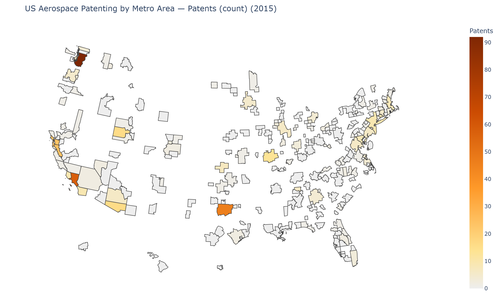
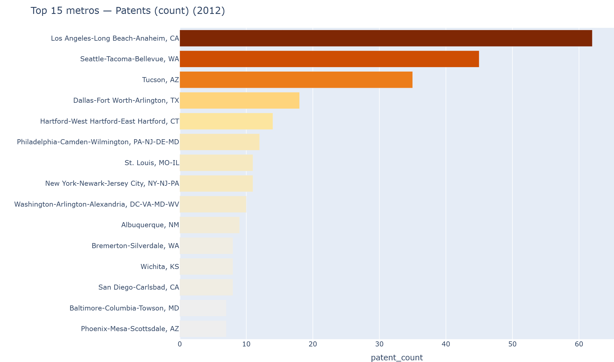
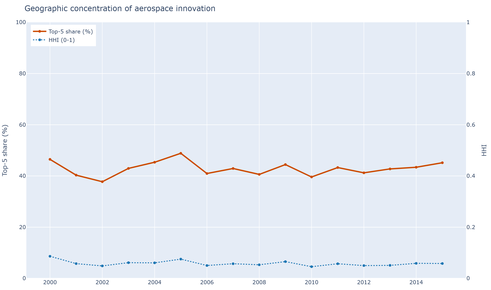
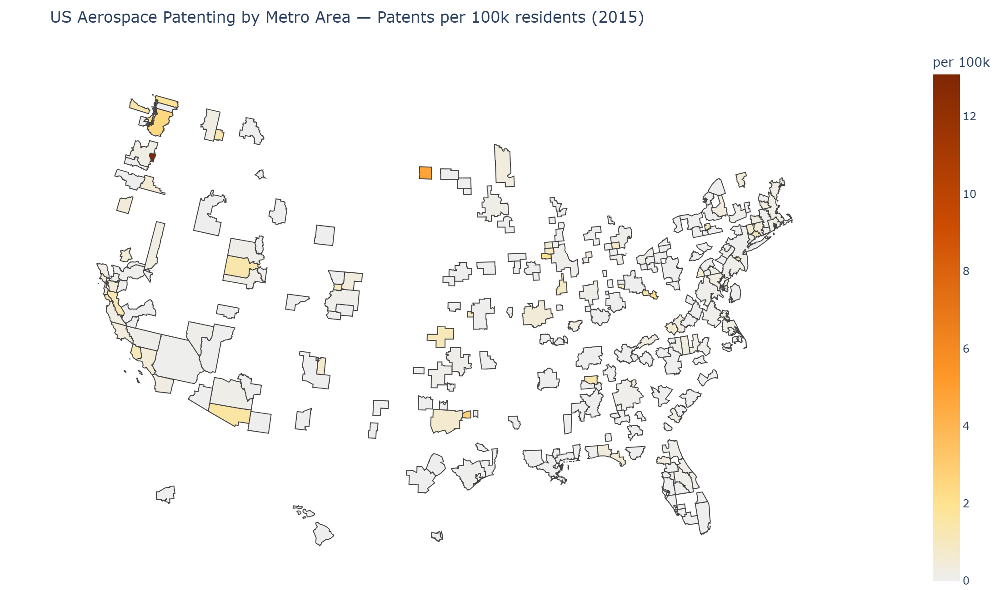

# US Aerospace Innovation Atlas ✈️🛰️

> Where America invents aerospace — a 16-year, 5,200+-patent geographic data product, built end-to-end.

`Python` · `pandas` · `GeoPandas` · `Plotly Dash` · `BigQuery (SQL)` · geospatial · ETL pipeline

**Che-Wei Lee** — M.S. in Data Analytics Engineering, Northeastern University

## Highlights

- Built an **end-to-end geospatial pipeline** mapping **16 years (2000–2015) of 5,200+ U.S. aerospace patents** across **300+ metro areas**, integrating USPTO, Census, and Google BigQuery.
- **Found and fixed a silent data bug** that had dropped Los Angeles — the nation's #1 metro — to zero; restored it with a CBSA-code spatial join and validated against official USPTO totals.
- Engineered **concentration (Herfindahl), shift-share growth, and per-capita metrics**, then extended to **38K+ patents** via BigQuery to split aviation vs. space.
- Shipped an **interactive Plotly Dash dashboard** (animated map + drill-down) and a one-file interactive HTML report.



---

## The story

The original assignment plotted **2012** aerospace patents (USPC class 244) by metropolitan area, matching patent records to map polygons **by metro name**. That name match had a quiet flaw: the 2018 boundary file renamed *Los Angeles–Long Beach–**Santa Ana*** to *…–**Anaheim***, so Los Angeles — the country's **#1 metro with 62 patents** — silently fell to **zero** and vanished from the map and the Top 5.

This atlas:

1. **Fixes the bug** by joining on the stable **CBSA code** instead of the name, restoring Los Angeles to first place (validated against the original file).
2. **Expands one year into sixteen** (2000–2015) from the same USPTO source, enabling trends, animation, and concentration analysis.
3. **Adds per-capita normalization** (Census metro population) and **geographic-concentration metrics** (top-5 share, Herfindahl index).
4. **Ships an interactive dashboard** and a clean, reproducible notebook — the rebuilt notebook is **1.5 MB vs. the original 297 MB** (which had embedded the full map geometry into every figure's output).

| 2012 ranking (count) | Concentration over time | Per-capita view |
|---|---|---|
|  |  |  |

---

## Features

- 🗺 **Map tab** — choropleth of patenting intensity with a **year slider and play/animate**; switch between **absolute count**, **share of US total**, and **patents per 100k residents**. **Click any metro** to drill down into its time series and technology composition.
- 🏆 **Rankings tab** — Top-N metros for any year and metric.
- 📈 **Trends tab** — national time series, geographic-concentration (Top-5 share + HHI), and a **multi-metro comparison** of trajectories.
- 🔬 **Analysis tab** — **rank-mobility** bump chart, **CAGR** growth/decline ranking, and a **shift-share** decomposition (national-growth vs. industry-mix vs. competitive components) across technology classes.

## Quick start

```bash
pip install -r requirements.txt

# 1. download the data backbone (USPTO PTMT class-244 reports, via Internet Archive)
python src/download.py

# 2. build the tidy parquet warehouse (parses, fixes the CBSA join, validates vs 2012)
python src/build_dataset.py

# 3. add per-capita population (Census metro estimates)
python src/enrich.py

# 4a. launch the dashboard  ->  http://127.0.0.1:8050
python app/app.py

# 4b. or open the analysis notebook
jupyter lab notebooks/01_aerospace_atlas.ipynb

# 4c. or build one self-contained interactive HTML (no server — just open it)
python src/build_report.py   # -> reports/aerospace_atlas.html
```

> On Windows use `py` instead of `python`.

## Repository layout

```
src/
  config.py          data scope (CPC/USPC, years), paths, PTMT→CBSA crosswalk
  download.py        fetch PTMT class reports (Wayback Machine)
  build_dataset.py   parse → crosswalk to CBSA → validate → parquet warehouse
  enrich.py          Census CBSA population → per-capita
  api_client.py      OPTIONAL: USPTO ODP API (CPC B64, assignees, 2016+) — needs a free key
  viz.py             shared Plotly figure builders (used by app + notebook)
app/app.py           Plotly Dash dashboard
notebooks/           clean analysis notebook
data/
  geo/               2018 CBSA cartographic boundary shapefile
  raw/               downloaded source files (gitignored)
  processed/         parquet warehouse + simplified GeoJSON (small, committed)
reports/figures/     exported static charts
```

## Data sources & methodology

- **Patents:** USPTO PTMT *“Patenting In Technology Classes, Breakout By U.S. Metropolitan Area”*, **class 244 (Aeronautics & Astronautics)**, CY 2000–2015, preserved on the **Internet Archive**. Counts are **utility patent grants** attributed to the **inventor's** metro area; a patent with inventors in several metros is counted in each.
- **Geography:** U.S. Census 2018 Cartographic Boundary **CBSA** shapefile. The PTMT *ID Code* maps to the **CBSA GEOID** (last five digits), with a small override map for metros redefined between vintages (e.g. Los Angeles).
- **Population:** U.S. Census Bureau metropolitan **population estimates** (per-capita denominator; 2000–2009 backfilled with the 2010 estimate).

**Validation.** The reconstructed 2012 ranking reproduces the original assignment exactly (Los Angeles 62, Seattle 45, Tucson 35, Dallas–Fort Worth 18, Hartford 14) — once the CBSA-code join restores Los Angeles.

**Limitations.** USPC-244 grants only (not applications), 2000–2015. ~12% of small micropolitan areas in the source predate the 2018 boundary file and are omitted from the map (negligible aerospace activity).

## Optional: Aviation vs. Space, companies & recent years

USPC class 244 combines aeronautics *and* astronautics. To split **Aviation vs.
Space**, add **assignee companies**, and extend to **recent years (→2024)**, use
**Google Patents Public Data on BigQuery** — which needs only a **Google account**
(no ID.me):

```bash
pip install google-cloud-bigquery db-dtypes
gcloud auth application-default login          # log in with your Google account
set GOOGLE_CLOUD_PROJECT=your-project-id        # BigQuery has a 1 TB/month free tier
python src/bigquery_aerospace.py                # -> aviation_vs_space.png, top_assignees.png
```

This runs **alongside** (not instead of) the keyless warehouse, writing
`aviation_space_national.parquet`, `aviation_space_assignees.parquet`, and two
charts.

*(Alternative: `src/api_client.py` uses the USPTO ODP API for the same B64 data,
but that requires an ID.me-verified USPTO API key.)*

Without any of this, every other part of the project runs fully on the keyless
PTMT backbone.

## Tech stack

Python · pandas · GeoPandas · Plotly / Dash · PyArrow (Parquet) · Requests

---

*Built as a portfolio expansion of an IE6600 data-visualization assignment.*
