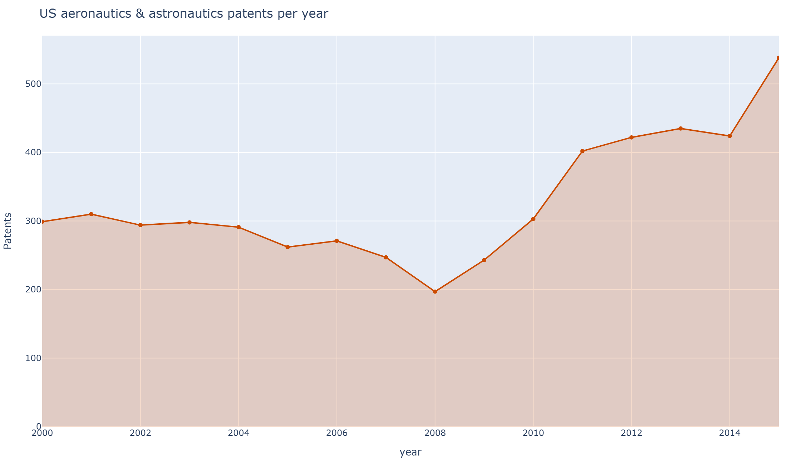
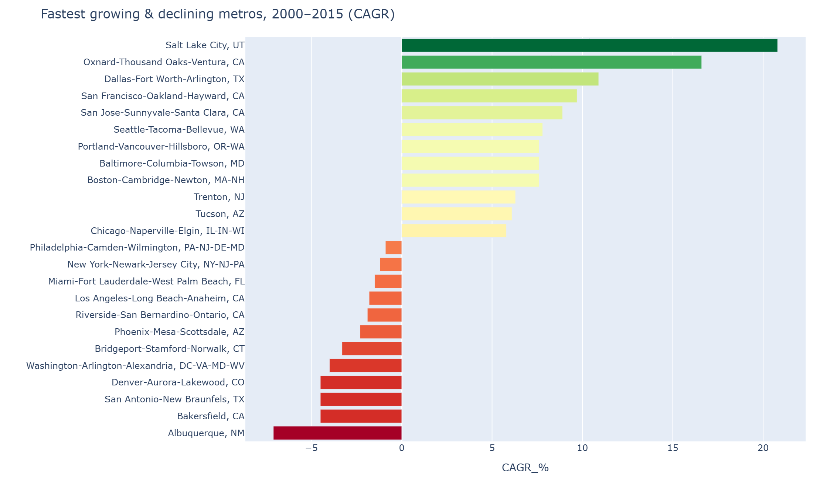
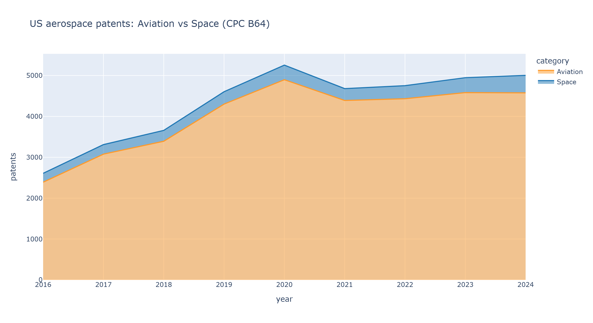
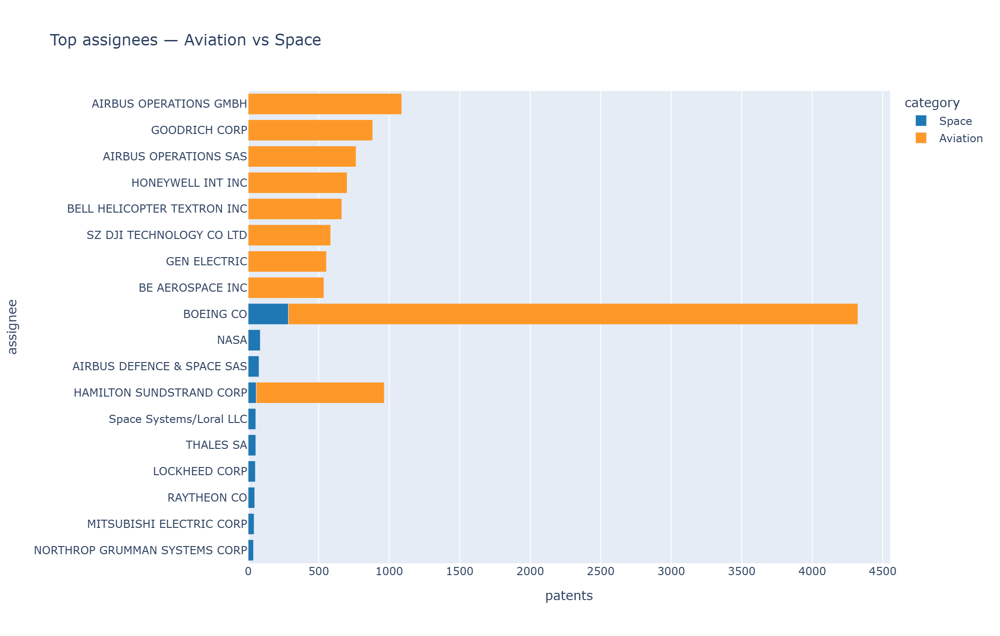

# Where America Invents Aerospace
### A geographic analysis of U.S. aeronautics & astronautics patents, 2000–2015 (with 2016–2024 extension)

---

## Summary

U.S. aerospace innovation is strikingly concentrated: just **five metropolitan areas account for ~40% of all aeronautics & astronautics patents** granted from 2000–2015, and the top two — **Los Angeles** and **Seattle** — alone produced **1,471** of the country's **5,236** patents in the class. Yet the map is not static. Over the period, **Seattle overtook Los Angeles** as the nation's top aerospace inventor, newer hubs (Dallas–Fort Worth, Salt Lake City, the Bay Area) grew at double-digit rates, and older centers (Albuquerque, Denver, Washington D.C.) declined. Extending to 2016–2024 via Google Patents shows aerospace patenting accelerating, dominated by **Boeing**, with a small but fast-growing **space** segment led by Boeing, NASA, and the major defense primes.

This report is built on a corrected dataset: the original analysis had silently lost the #1 metro to a data-matching bug (see below).

---

## 0. A correction worth leading with

The original study matched patent records to map boundaries **by metropolitan name**. Because the 2018 boundary file renamed *Los Angeles–Long Beach–**Santa Ana*** to *…–**Anaheim***, Los Angeles failed to match and was recorded as **zero patents** — dropping the single largest aerospace metro in the country out of the map and the rankings entirely.

Re-joining on the stable **CBSA code** restores Los Angeles to **first place (62 patents in 2012; 770 over 2000–2015)** and reproduces the source totals exactly. Every finding below rests on the corrected join.

---

## 1. The national picture

The U.S. granted **5,236** class-244 (aeronautics & astronautics) patents to metro-based inventors over 2000–2015, rising from **299** in 2000 to a peak of **538** in 2015 — roughly **+80%** across the period.

## 2. Innovation is highly clustered — but slowly diffusing

The top five metros held **~45%** of national aerospace patenting throughout the period. The largest centers over 2000–2015 were:

| Metro | Patents (2000–2015) |
|---|---:|
| Los Angeles–Long Beach–Anaheim, CA | 770 |
| Seattle–Tacoma–Bellevue, WA | 701 |
| Dallas–Fort Worth–Arlington, TX | 248 |
| Tucson, AZ | 207 |
| Phoenix–Mesa–Scottsdale, AZ | 176 |
| New York–Newark–Jersey City | 167 |
| St. Louis, MO–IL | 161 |
| Washington–Arlington–Alexandria | 133 |

Concentration eased slightly: the **Herfindahl index fell from 0.086 (2000) to 0.058 (2015)**, and the top-5 share edged from 46.5% to 45.2% — innovation spreading to more metros even as the leaders held their lead.

## 3. The headline shift: Seattle overtakes Los Angeles

In 2000, Los Angeles (77 patents) led Seattle (29) by more than 2.5×. But Seattle's commercial-aircraft and aerostructures base drove sustained growth while Los Angeles plateaued. The lead changed hands around **2013–2014**, and by **2015 Seattle (92) led Los Angeles (58)** decisively.

| Year | Los Angeles | Seattle |
|---:|---:|---:|
| 2000 | 77 | 29 |
| 2008 | 22 | 31 |
| 2012 | 62 | 45 |
| 2014 | 36 | 80 |
| 2015 | 58 | 92 |

## 4. Who's rising, who's fading

Measuring compound annual growth (CAGR) for established metros, 2000→2015:

**Rising:** Salt Lake City (**+20.8%/yr**), Oxnard–Ventura (+16.6%), Dallas–Fort Worth (+10.9%), San Francisco (+9.7%), San Jose (+8.9%).

**Fading:** Albuquerque (**−7.1%/yr**), San Antonio (−4.5%), Bakersfield (−4.5%), Denver (−4.5%), Washington D.C. (−4.0%).

The pattern suggests a westward and tech-corridor drift — toward the Bay Area, the Mountain West, and Texas — and away from several traditional government/defense-lab metros.

## 5. Per-capita: the specialist towns

Raw counts favor big metros. Normalizing by population (per 100,000 residents, 2015) surfaces highly specialized aerospace economies:

| Metro | Patents/100k (2015) |
|---|---:|
| Seattle–Tacoma–Bellevue, WA | 2.46 |
| Bremerton–Silverdale, WA | 2.32 |
| Tucson, AZ | 1.59 |
| Salt Lake City, UT | 1.37 |
| Huntsville, AL | 1.35 |
| San Jose–Sunnyvale–Santa Clara, CA | 1.22 |

Seattle leads on **both** absolute and per-capita measures — a rare double — while Tucson and Huntsville punch far above their size, reflecting concentrated defense/aerospace employers.

## 6. Decomposing growth: a shift-share view

A shift-share model splits each metro's change into three sources: **national growth** (the rising tide), **industry mix** (whether its tech classes were nationally hot), and **competitive shift** (local out/under-performance). Across the analyzed technology classes:

- **San Jose, Seattle, San Francisco, Ann Arbor** show strong **positive competitive shift** — winning more than the national trend would predict.
- **Los Angeles**, despite the largest base, has a **negative competitive shift (−189)** — its decline is locally driven, not just national.

> *Caveat:* the multi-class basket includes class 701 (data processing for vehicles/navigation), which is auto-industry heavy. This inflates Detroit and Ann Arbor in the shift-share and should be read as "aerospace-adjacent navigation/avionics," not pure aerospace.

---

## 7. Extension — Aviation vs. Space and the companies (2016–2024)

USPC class 244 combines aeronautics and astronautics. Using Google Patents (CPC subclass **B64**, B64G = space) to split them and identify assignees for **2016–2024**:

- **Aviation dominates**: 36,037 aviation patents vs. **2,778 space** — roughly **13 : 1** — but both are growing (space from 217 in 2016 to 427 in 2024).

- **Boeing leads both domains** (4,039 aviation; 285 space). Other leaders:

| Aviation | Space |
|---|---|
| Boeing, Airbus, Hamilton Sundstrand, Goodrich, Honeywell, Bell Helicopter, **DJI (drones)**, GE | Boeing, **NASA**, Airbus Defence & Space, Lockheed, Raytheon, Northrop Grumman |

The appearance of **DJI** among top aviation assignees reflects the rise of unmanned aerial vehicles (CPC B64U) as a patent-heavy segment in the late 2010s.

### Aviation and space have different maps

Placing 2016–2021 CPC-B64 patents at their inventors' coordinates and joining to metros reveals that **aviation and space cluster in different cities**:

| Aviation leaders (2016–2021) | Space leaders (2016–2021) |
|---|---|
| Seattle (Boeing) | **Los Angeles** |
| Dallas–Fort Worth | San Jose |
| Los Angeles | Washington, D.C. |
| Hartford (Pratt & Whitney) | Seattle |
| San Jose | Denver (Lockheed / ULA) |
| Phoenix | **Houston (NASA Johnson)** |

**Seattle is the capital of aviation invention; Los Angeles is the capital of space.** Space's footprint also tracks NASA centers and defense primes (Denver, Houston, D.C.), whereas aviation follows the airframe and engine manufacturers.

*(This recent-years layer uses CPC B64 with inventor coordinates spatially joined to metros — a different classification and counting method than the 2000–2015 USPC-244 series, so the two should be read on their own scales rather than spliced into one trend.)*

---

## Methodology & limitations

- **Backbone (2000–2015):** USPTO PTMT class-244 reports (utility patent grants by inventor metro), preserved on the Internet Archive; joined to 2018 Census CBSA boundaries by code; population from Census metro estimates.
- **Extension (2016–2024):** Google Patents Public Data on BigQuery, CPC B64; national/company level (no metro detail).
- **Limitations:** grants (not applications); USPC-244 combines aviation and space for 2000–2015; ~12% of small micropolitan areas predate the 2018 boundaries and are mapped without geometry; pre-2010 per-capita uses 2010 population; the shift-share class basket includes auto-adjacent navigation patents.

*Reproducible pipeline, interactive dashboard, and one-file HTML report: see [README](README.md).*
